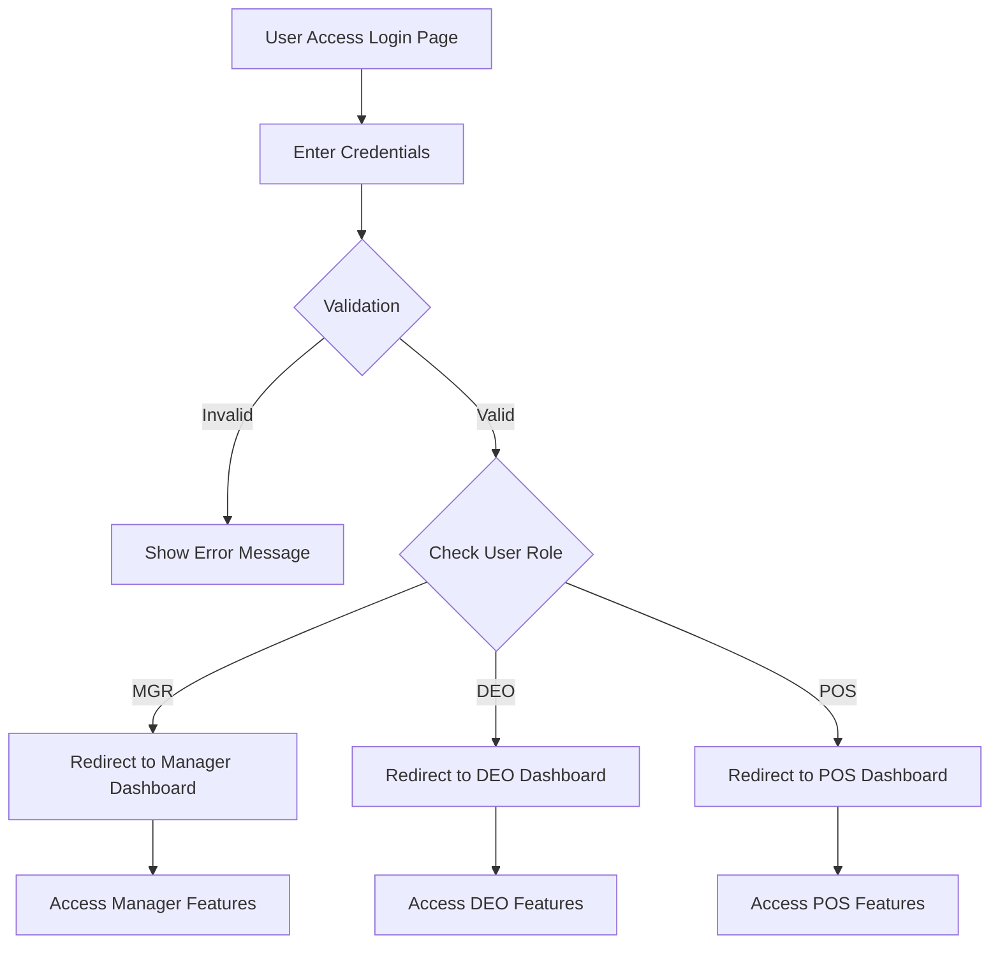
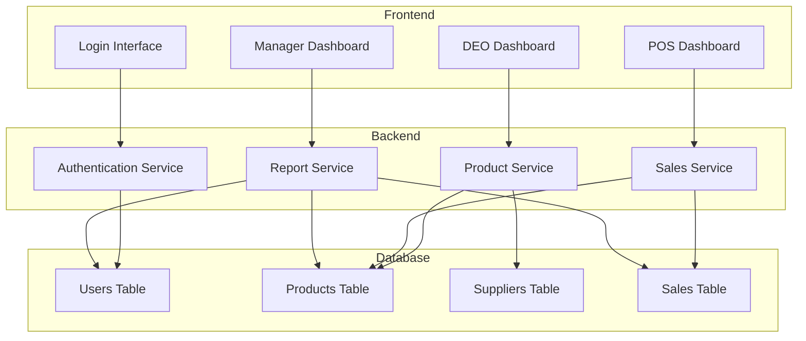

# InventoryApp
A Java Servlet-based Inventory Management Web Application using MVC architecture and PostgreSQL
# 🏪 Inventory Management Web Application

A **Java Servlet-based Inventory Management System** built using **MVC architecture** and **PostgreSQL**.  
This project demonstrates real-world use of Servlets, JDBC, and Database Integration in a clean, modular structure.  

---

## 🚀 Features

### 👨‍💻 Role-Based Access
- **DEO (Data Entry Operator):** Add new products (with supplier validation and unique product IDs).  
- **POS (Point of Sale Staff):** Perform sales, reduce stock, and calculate total price dynamically.  
- **MGR (Manager):** View products with stock levels below 50 for restocking decisions.  

---

## 🧩 Tech Stack

| Layer | Technology |
|-------|-------------|
| Frontend | HTML5 |
| Backend | Java Servlets (Jakarta EE) |
| Database | PostgreSQL |
| Design Pattern | MVC (Model-View-Controller) |
| Server | Apache Tomcat 11 |
| Language | Java (JDK 17+) |

---

## 🏗️ Project Structure
```bash
InventoryApp/
├── src/
│ └── main/
│ ├── java/
│ │ └── com/
│ │ └── company/
│ │ ├── controller/ # Servlets
│ │ ├── dao/ # Data Access Objects
│ │ ├── model/ # Entity Classes
│ │ ├── service/ # Business Logic
│ │ └── util/ # Utilities
│ └── webapp/
│ ├── WEB-INF/
│ │ ├── web.xml # Deployment Descriptor
│ │ └── classes/
│ ├── css/ # Stylesheets
│ ├── js/ # JavaScript files
│ ├── views/ # JSP pages
│ └── index.html # Login Page
├── pom.xml # Maven Configuration
├── README.md
├── .gitignore
└── LICENSE
```

---

## 💾 Database Setup (PostgreSQL)

```sql
CREATE DATABASE Inventory;

\c Inventory;

CREATE TABLE users (
    userid VARCHAR(20) PRIMARY KEY,
    password VARCHAR(50),
    fullname VARCHAR(50),
    role VARCHAR(10) CHECK (role IN ('DEO','POS','MGR'))
);

INSERT INTO users VALUES
('admin','admin123','Administrator','MGR'),
('nish','nish123','The Great Nish','DEO'),
('user1','user123','Sample User 1','POS');

CREATE TABLE supplier (
    supplierid VARCHAR(20) PRIMARY KEY,
    name VARCHAR(50),
    contact VARCHAR(15),
    email VARCHAR(50)
);

CREATE TABLE product (
    productid VARCHAR(20) PRIMARY KEY,
    name VARCHAR(50),
    supplierid VARCHAR(20) REFERENCES supplier(supplierid),
    stockavailable INT,
    openingstock INT,
    lastsupplydate DATE,
    unitprice NUMERIC(10,2)
);
```
---

## 🧠 Workflow

### 🔐 Authentication Flow


### 1️⃣ Login & Authentication
- User enters credentials on login page
- System validates against database
- Redirects to role-specific dashboard based on user role

### 2️⃣ DEO (Data Entry Operator)
**Main Task:** Add Products
- Fill product form with details
- System validates supplier exists
- Checks product ID uniqueness
- Adds product to database
- Updates inventory records

### 3️⃣ POS (Point of Sale)
**Main Task:** Process Sales
- Enter product ID to search
- System shows product details & stock
- Enter quantity to sell
- Automatic price calculation
- Stock automatically deducted
- Sales transaction recorded

### 4️⃣ MGR (Manager)
**Main Tasks:** Monitor & Analyze
- View low stock alerts (stock < 50)
- Check sales reports and analytics
- Monitor inventory health
- Manage user accounts and roles

---
### Quick flow
```
Login → Role Check → Dashboard → Perform Actions → Logout
↓
DEO: Add Products → Validate → Save to DB
POS: Sell Products → Calculate → Update Stock
MGR: View Reports → Analyze → Make Decisions
    
```
## 🧠 System Architecture


## MVC Architecture

```
+------------------+        +---------------------+        +--------------------+
|      View        | --->   |      Controller      | --->   |       Model        |
| (JSP/HTML)       |        | (Servlets)           |        | (DAO + Entities)   |
+------------------+        +---------------------+        +--------------------+
        ↑                         ↑                              ↑
        |                         |                              |
+------------------+        +---------------------+        +--------------------+
|   User Interface |        |  Business Logic     |        | Database Layer     |
|   Forms & Pages  |        |  Request Handling   |        | JDBC & SQL         |
+------------------+        +---------------------+        +--------------------+

```

## 🚀 Future Enhancements

- 🧩 **Role-Based Dashboard UI:** Enhance each role (DEO, POS, MGR) with interactive HTML dashboards using AJAX for real-time updates.  
- 📦 **Sales History Tracking:** Maintain a `Sales` table to store transaction details and generate periodic sales reports.  
- 🔔 **Low Stock Alerts:** Automatically email or notify managers when stock drops below a defined threshold.  
- 📊 **Analytics Module:** Integrate charts (using Chart.js) to visualize sales and stock trends.  
- ☁️ **Cloud Deployment:** Host the application on AWS / Render using PostgreSQL Cloud for real-world scalability.  
- 🧠 **AI-Powered Stock Prediction:** Use a lightweight ML model to forecast product demand and optimize inventory.  

---

## 👨‍💻 Author

**Nishant (The Great Nish)**  
- 💼 Developer & Architect of *InventoryApp*  
- 💬 Passionate about **Java, AI/ML, and Cybersecurity**  
- 🌐 GitHub: [@nishant-cipher](https://github.com/nishant-cipher)  
- 📧 Contact: nishant.cipher@gmail.com

---

## 🪪 License

This project is licensed under the **MIT License** — you’re free to use, modify, and distribute it with attribution.
MIT License
Copyright (c) 2025 Nishant


